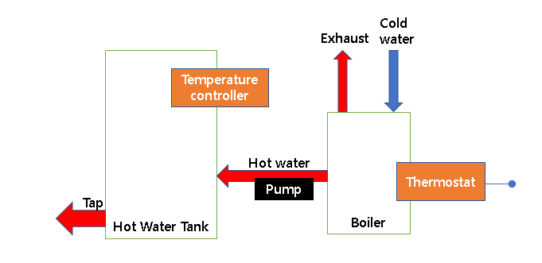
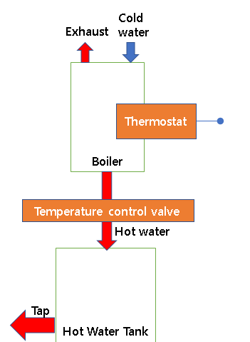
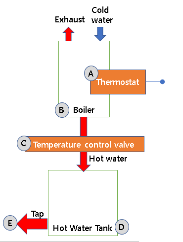

# Challenge

Given a simple water heating system with: 
o        a temperature controller 

o        a boiler with minimum cold water in and hot water out 

o        a hot water tank with a minimum outlet operated by a tap 

o        a water tank thermostat 

o        a pump 

•            a number of valves (you decide how many).  

·                Provide a sketch of a sensible system and functions necessary to maintain the water at a defined temperature 

·                List any potential improvements that may be made to the system 

·                Write some pseudo code that illustrates a control function to execute on the temperature controller 

·                Convert the pseudo code into a software function that may be implemented 
 
 #### Current Flow
 

# Solution
From the above flow, following are the drawbacks
1. We need to have a temperature sensor as well as a thermostat. 
	
    Improvement: Include a single thermostat that will accept the set temperature at the boiler only.
2. Pump needs to draw the water from the boiler to the tank
	
    Improvement: Replace the pump with a control valve that will let the hot water flow into the tank once the requred temperature is attained.
	
    Also, placing the boiler above the tank helps to draw the water into the tank without the need of a pump. Let gravity take its effect!
	
This design is more compact and efficient. 

##### New Flow:

1. User enters required temperature on thermostat[A]

2. Function StartWaterHeatingSystem() is called. The cold water is connected at the top, with exhaust to hold the heat.

3. Once desired temperature is attained in the boiler[B], the temperature control valve[C] opens and passes the hot water into the hot water tank[D]

4. Mixing valves needs to be present for a constant hot water delivery temperature.

5. User turns on the tap[E] to get the hot water.

#### Pseudo code:
<addr>
    
    func StartWaterHeatingSystem()
    
        Input temperature as inputTemp from thermostat
	    Get current temperature as currentTemp
        TurnOnBoiler()
	    while (currentTemp < inputTemp)
	    begin
		    Let the water get heated
	    end

    func TurnOnBoiler
        if water level is within limits
	        turn on boiler

<addr>

##### Safely measures:
The boiler is not turned on, if the water level is low.
	
##### Language consideration
Python is used, as this problem is more functional based and is embedded. 

### Prerequisites

Python needs to be installed

## Authors

Soshan Fernandes